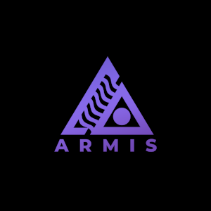

  

## Hi there, welcome to my Github! 👋

## About Me

I'm a design engineer specializing in pioneering agentic UI/UX patterns and intent-driven interfaces. I focus on transforming traditional page-based navigation into innovative agent-driven experiences where AI orchestrates user interactions dynamically.

Currently, I'm building tools that make professional engineering more accessible and affordable, with a particular focus on audio engineering platforms and career management solutions.

## Skills

- **UI/UX Design & Development** - Specializing in agentic interface patterns and intent-driven flows
- **Full-Stack Development** - Building scalable web applications with modern frameworks
- **Audio Engineering** - Sound design, mixing, and mastering with FL Studio
- **Data Visualization** - Creating intuitive, accessible charts and interactive components
- **Product Design** - User-first design philosophy and accessible interface development

## Beyond Code

Outside of software development, I have a deep passion for music production and sound design. Check out my work on [SoundCloud ☁️🎧](https://soundcloud.com/armisofficial)

## Connect with Me

- [Portfolio](https://theproducersfriend.com/)

Feel free to explore my repositories and reach out if you have any questions!
